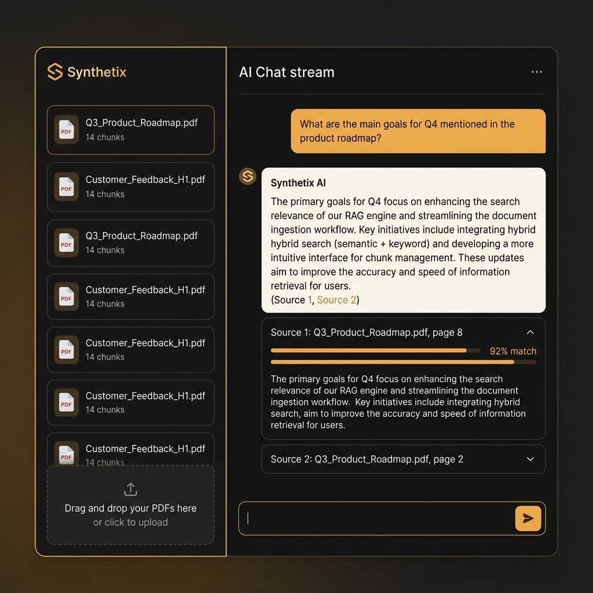
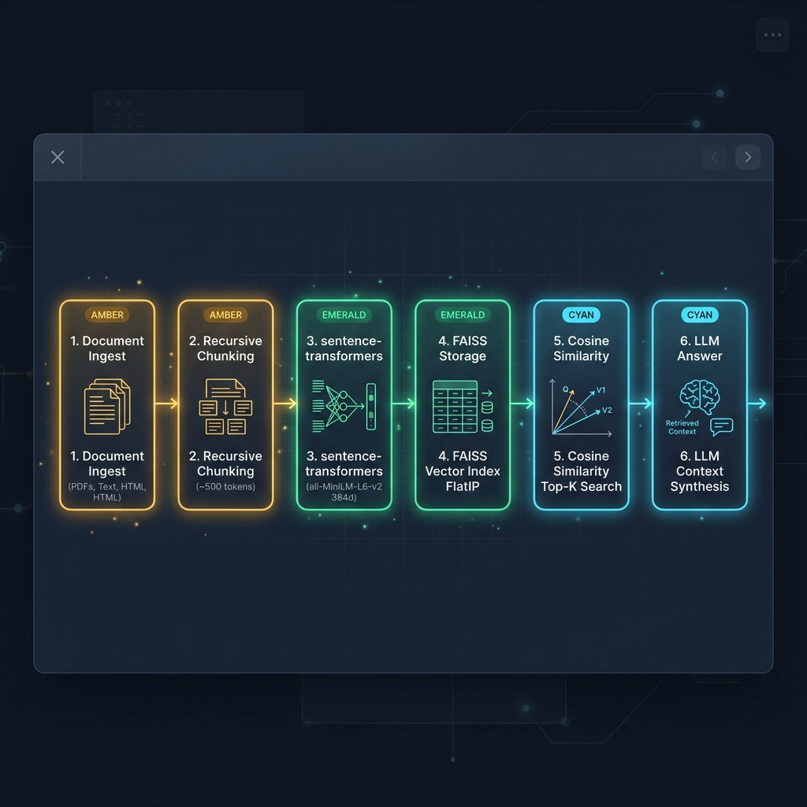

# Synthetix | Enterprise RAG Document Q&A Platform

> A production-grade **Retrieval-Augmented Generation (RAG) Document Q&A Platform** built with **FastAPI**, **FAISS**, **Sentence-Transformers**, and **React + Vite + Tailwind CSS**. 



---

## 🌟 Key Features

- **Groq LPU API Integration**: Powered by Groq's high-speed LPU infrastructure (`openai/gpt-oss-120b`) delivering context-bounded LLM answer synthesis in ~1.4 seconds.
- **High-Performance Vector Pipeline**: Ingests PDF and `.txt` documents, extracts content cleanly, and computes 384-dimensional dense vector embeddings using CPU-optimized `sentence-transformers/all-MiniLM-L6-v2` — **no paid API keys required**.

- **Recursive Token-Aware Chunking**: Chunks text with a ~500 token target window (2000 characters) and a 50-token overlap (200 characters) to capture full semantic concepts while preserving boundary context across adjacent chunks.
- **FAISS Disk Persistence**: Index Flat Inner Product (`IndexFlatIP` on unit-normalized vectors = Cosine Similarity) persisted to disk in `backend/data/faiss_store/`. Index state and document metadata survive server restarts.
- **Zero-Hallucination Guardrails**: Queries with top similarity scores below a strict threshold (`SIMILARITY_THRESHOLD = 0.35`) trigger an explicit *"not found in the document"* fallback rather than inventing ungrounded facts.
- **Multi-Provider LLM Integration**: Configurable support for local **Ollama** daemons (`llama3.2`, `mistral`), **OpenAI API**, or an offline **Extractive Context Synthesizer** fallback.
- **Crafted Product UI**: Two-panel responsive dashboard layout built with React, Vite, and Tailwind CSS. Features an obsidian dark technical theme, warm amber/emerald color system, Space Grotesk typography, expandable source citation accordions with visual match percentage bars, and dark/light mode persistence.
- **Interactive Pipeline Modal**: Embedded SVG horizontal architecture flow diagram explaining the technical execution sequence.
- **Comprehensive Pytest Suite**: 100% automated test coverage covering chunking logic, embedding dimensions (384d), vector retrieval ordering, score threshold fallbacks, duplicate upload prevention, and corrupt PDF error handling.
- **GitHub Actions CI**: Automated test runner executing pytest suite on every push and pull request.

---

## 🚀 Quick Start (2-Command Local Execution)

### Step 1: Start Backend (FastAPI + FAISS)

Open Terminal 1:
```bash
cd backend
python -m venv venv
# On Windows:
venv\Scripts\activate
# On Linux/macOS:
# source venv/bin/activate

pip install -r requirements.txt
uvicorn app.main:app --reload --port 8000
```
*Backend runs at `http://127.0.0.1:8000` with interactive Swagger API docs at `http://127.0.0.1:8000/docs`.*

### Step 2: Start Frontend (React + Vite)

Open Terminal 2:
```bash
cd frontend
npm install
npm run dev
```
*Frontend app runs at `http://localhost:5173`.*

---

## 🏗️ Architecture & Pipeline Flow



```
+------------------+     +------------------------+     +----------------------------+
| Document Upload  | --> |  Recursive Chunking    | --> | sentence-transformers      |
| (.pdf / .txt)    |     |  (~500 tokens / 50 ov) |     | (all-MiniLM-L6-v2, 384d)   |
+------------------+     +------------------------+     +----------------------------+
                                                                     |
                                                                     v
+------------------+     +------------------------+     +----------------------------+
| LLM Synthesis    | <-- | Top-K Cosine Search    | <-- | FAISS FlatIP Vector Store  |
| (Ollama/OpenAI)  |     | (Threshold >= 0.35)    |     | (Disk Persisted Index)     |
+------------------+     +------------------------+     +----------------------------+
```

### Chunking Rationale
- **Chunk Size (~500 tokens / 2000 chars)**: sentence-transformers (`all-MiniLM-L6-v2`) has an optimal context window of 256/512 tokens. A ~500 token target captures complete paragraphs and logical subsections without diluting specific facts in overly long text.
- **Chunk Overlap (~50 tokens / 200 chars)**: 50-token overlap ensures continuous context across adjacent chunks, preventing sentences or named entities spanning chunk boundaries from being severed during vector lookup.

---

## 🧪 Running the Pytest Suite

Run all automated unit tests:

```bash
pytest backend/tests -v
```

### Test Suite Summary:
1. `test_chunking_correctness`: Verifies chunk bounds, overlap size, and metadata structure.
2. `test_embedding_dimensions`: Confirms `all-MiniLM-L6-v2` produces exact 384-dimensional output vectors.
3. `test_retrieval_top_k`: Validates FAISS top-k search ordering and score descending sort.
4. `test_no_match_fallback`: Verifies query against irrelevant documents yields low similarity score and triggers `"not found in the document"` response.
5. `test_malformed_pdf_case`: Ensures corrupt PDF bytes raise clean `IngestionError` without server crash.
6. `test_duplicate_upload`: Verifies SHA-256 hash deduplication rejects duplicate file ingestion.

---

## 📁 Repository Structure

```
.
├── .github/
│   └── workflows/
│       └── test.yml           # GitHub Actions Pytest Workflow
├── backend/
│   ├── app/
│   │   ├── api/
│   │   │   └── routes.py      # FastAPI upload, query, document & health endpoints
│   │   ├── core/
│   │   │   ├── embeddings.py  # sentence-transformers singleton wrapper
│   │   │   ├── ingestion.py   # PDF/TXT extraction & recursive character chunker
│   │   │   ├── rag_engine.py  # Top-K retrieval, thresholding & LLM synthesis
│   │   │   └── vector_store.py# FAISS FlatIP index management & disk persistence
│   │   ├── config.py          # Pydantic environment configuration
│   │   └── main.py            # FastAPI entrypoint & CORS middleware
│   ├── data/
│   │   └── faiss_store/       # Disk persisted FAISS index & metadata.json
│   ├── tests/
│   │   └── test_rag.py        # Pytest test suite
│   └── requirements.txt
├── docs/
│   └── screenshots/           # Architecture diagrams & UI screenshots
├── frontend/
│   ├── src/
│   │   ├── components/
│   │   │   ├── ChatArea.jsx        # Q&A message stream & prompt pills
│   │   │   ├── Header.jsx          # Top bar, status badges & dark toggle
│   │   │   ├── PipelineModal.jsx   # SVG horizontal execution diagram modal
│   │   │   ├── Sidebar.jsx         # Drag-and-drop dropzone & doc manager
│   │   │   ├── SourceCitations.jsx # Citation accordion with similarity bars
│   │   │   └── Toast.jsx           # Floating status toasts
│   │   ├── api.js                 # Axios/Fetch API client wrapper
│   │   ├── App.jsx                # Main React state container
│   │   ├── index.css              # Global styles & Tailwind directives
│   │   └── main.jsx               # React DOM entrypoint
│   ├── tailwind.config.js
│   ├── vite.config.js
│   └── package.json
└── README.md
```

---

## ⚙️ Configuration & Environment Variables

Create a `backend/.env` file to customize settings:

```env
# Vector & Chunking Settings
CHUNK_SIZE=2000
CHUNK_OVERLAP=200
SIMILARITY_THRESHOLD=0.35
TOP_K=4

# LLM Provider ('auto', 'ollama', 'openai', or 'fallback')
LLM_PROVIDER=auto
OLLAMA_BASE_URL=http://localhost:11434
OLLAMA_MODEL=llama3.2
OPENAI_API_KEY=
```
